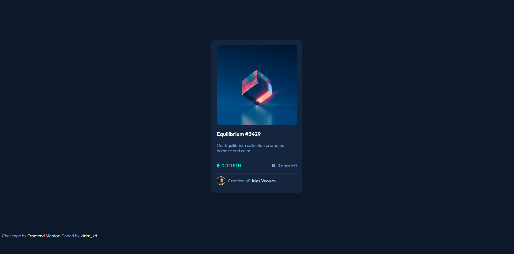
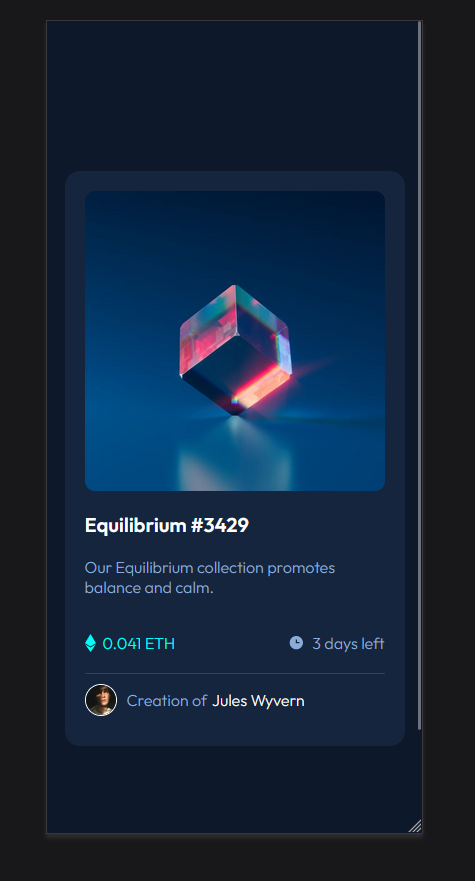

# Frontend Mentor - QR code component solution

This is a solution to the [NFT preview card component on Frontend Mentor](https://www.frontendmentor.io/challenges/nft-preview-card-component-SbdUL_w0U). Frontend Mentor challenges help you improve your coding skills by building realistic projects.

i couldnt get to work the hover view icon on the NFT Image...

## Table of contents

- [Overview](#overview)
  - [Screenshot](#screenshot)
  - [Links](#links)
- [My process](#my-process)
  - [Built with](#built-with)
- [Author](#author)

## Overview

### Screenshot

### Links

- Live Site URL: [Add live site URL here](https://your-live-site-url.com)

## My process

### Built with

- Semantic HTML5 markup
- CSS custom properties
- Flexbox
- Grid
  -CSS Filters

## Author

- Twitter - [@xtrim_xd](https://www.twitter.com/xtrim_xd)
